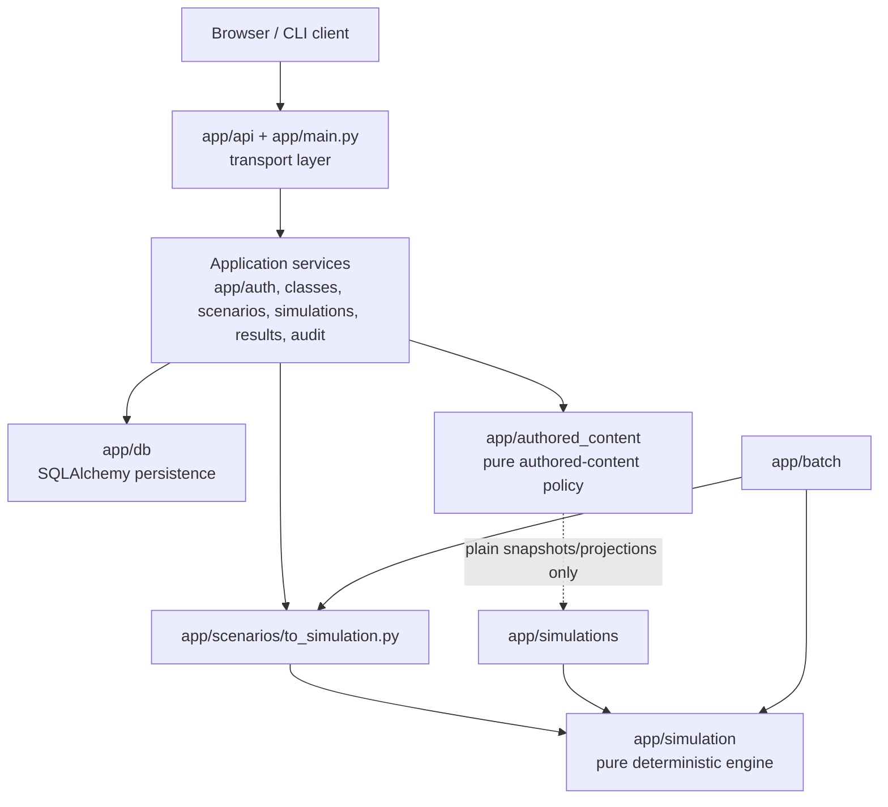
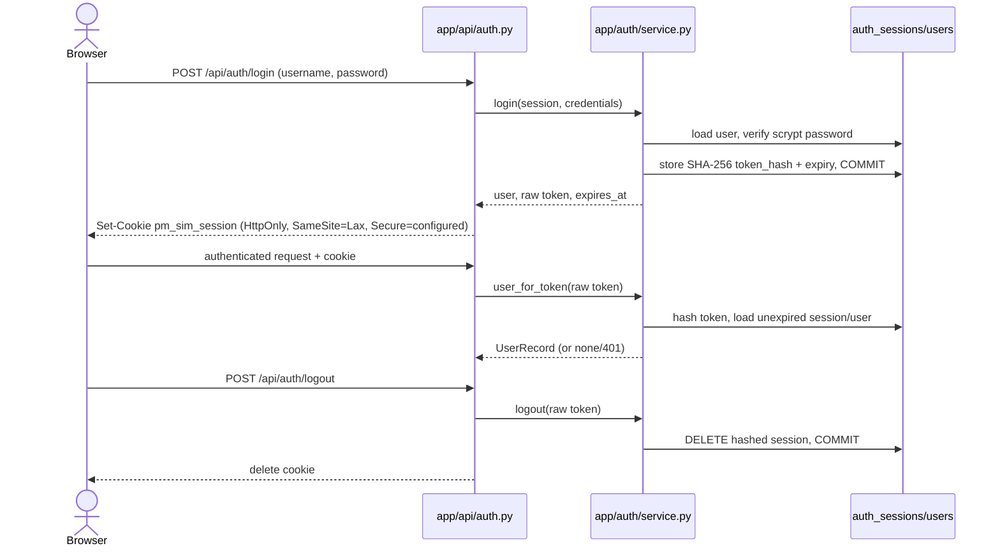
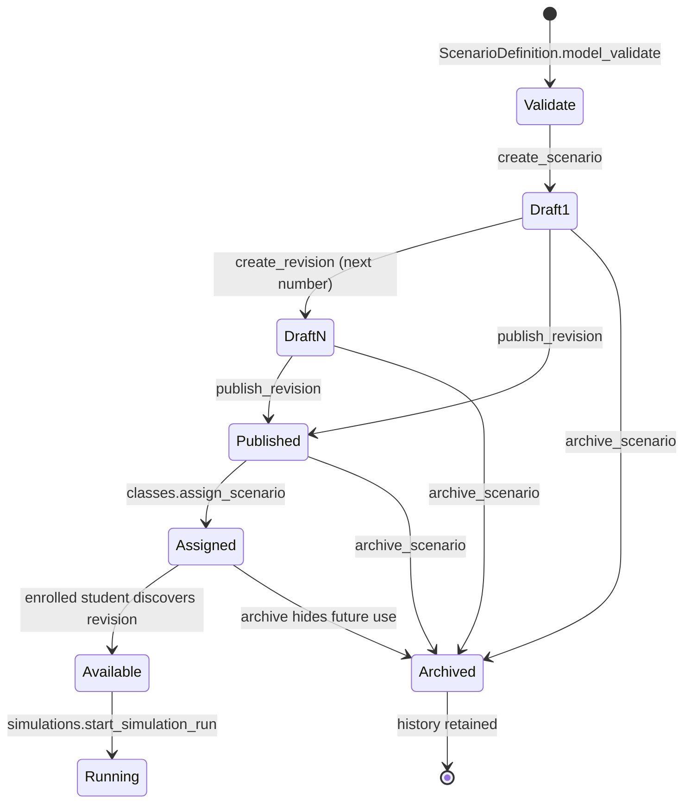
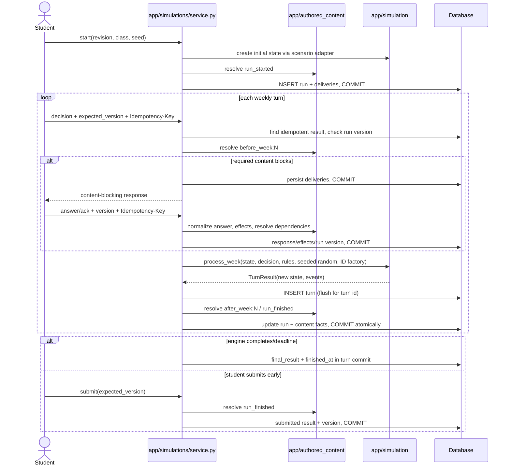
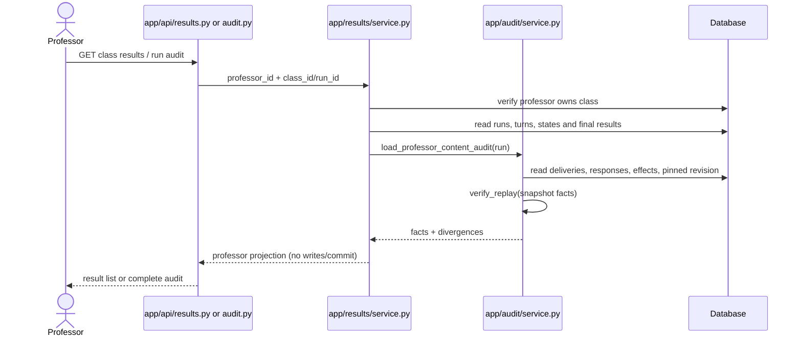
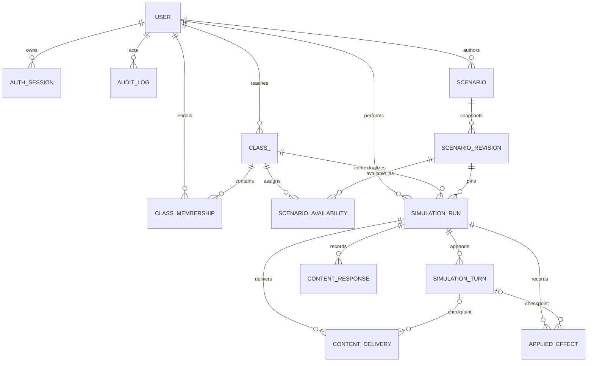

# Backend architecture

## Purpose and boundaries

The backend separates simulation rules from HTTP and persistence:

```text
browser
  -> FastAPI routes (app/api)
  -> application services (app/auth, app/classes, app/scenarios, app/simulations, app/results)
  -> SQLAlchemy models and sessions (app/db)

scenario definition
  -> scenario adapter (app/scenarios/to_simulation.py)
  -> pure simulation engine (app/simulation)
```

`app/authored_content` is a separate package boundary for definition loading, triggers,
dependencies, answer normalization, presentation effects, digests, and replay. It may consume
persisted authored facts and plain projection values, but it does not import simulation randomness,
`SimulationState`, or `process_week`, and it never mutates a run. `app/simulations/service.py` is
the integration owner that coordinates both packages.

The modules in `app/simulation` must not import FastAPI, SQLAlchemy, or database models. This
keeps a simulation deterministic and makes the same engine usable by persisted HTTP runs and
the in-memory batch runner.


## Package map and dependency policy

The package boundary—not an individual route—is the unit of ownership. “Public entry points” below
means the modules and named functions that callers should use; other helpers are implementation
details. A service that owns a write transaction commits all of its domain rows and audit rows
together. Read-only services never commit.

| Package | Responsibility and public entry points | Allowed dependencies | Transaction owner | Prohibited dependencies |
| --- | --- | --- | --- | --- |
| `app/api` | FastAPI transport, request/response models, authentication dependencies, and exception-to-HTTP mapping. `app.main:app`; each module's `router`; `auth.current_user`, `CurrentUser`, and `ProfessorUser`. | Application services, `app.db.session`, response-safe DB enums/records, configuration. | None. It obtains a request-scoped `Session`; routes must not commit. | Engine algorithms, authored-content internals, direct persistence mutations, or business-rule duplication. |
| `app/auth` | Password hashing/verification and opaque, hashed, expiring sessions. `create_user`, `login`, `user_for_token`, `logout`, `change_password`, `hash_password`, `token_hash`. | Configuration and auth/user records in `app.db.models`. | The auth service commits credential and session changes, including expiry cleanup encountered during lookup. | FastAPI/cookies (transport policy belongs to `app/api/auth.py`), scenario/simulation packages, plaintext token persistence. |
| `app/audit` | Append administrative audit entries and assemble professor-only authored-content replay evidence. `record_audit`, `list_actor_audit`, `load_professor_content_audit`. | DB records and authored-content definition/replay verification. | `record_audit` only adds; the calling mutating service commits it. Retrieval is read-only. | HTTP concerns, commits, engine mutation, student-facing redaction policy. |
| `app/classes` | Professor-owned classes, membership/import/password reset, assignments, and student availability checks. Public functions in `service.py`, especially `create_class`, `import_students`, `assign_scenario`, `available_scenarios_for_user`, and `accessible_class_for_revision`. | Auth helpers, audit append, and DB records. | Mutating functions commit; bulk import explicitly rolls back an integrity conflict. Reads/access checks do not commit. | FastAPI, simulation engine, authored-content resolution, modifying scenario definitions. |
| `app/scenarios` | Validate scenario schemas, own immutable numbered revisions and lifecycle, and adapt definitions into engine inputs. `ScenarioDefinition`; service lifecycle functions; adapter functions in `to_simulation.py`. | Pydantic, audit append, DB scenario records; the adapter may construct `app.simulation` values. | Scenario service mutators commit scenario/revision plus audit; models/adapters are pure. | FastAPI, run persistence, authored runtime facts, engine importing persistence. Published revisions must not be edited in place. |
| `app/simulations` | **Persistence-oriented run application service**: authorization, checkpoints, engine/authored-content orchestration, optimistic versioning, idempotency, and atomic run/turn/fact persistence. `start_simulation_run`, `complete_simulation_turn`, `content_command`, `submit_simulation_run`, and run/turn queries. | Classes access checks, scenario adapter, pure engine, pure authored content, and DB records. | Owns every run mutation and commit, including content facts resolved as part of that command. | FastAPI, nondeterministic engine calls not represented by a seed, route-owned commits, mutating a published revision. |
| `app/results` | Read-only professor result lists and complete run/audit projections. `list_class_results`, `get_class_run_audit`; `ProfessorRunResult`, `ProfessorRunAudit`. | DB records, `app.audit` retrieval, and engine outcome enum. | None; read-only. | Commits, run mutation, student authorization, recalculating historic turns with the current engine. |
| `app/authored_content` | Pure definition loading, trigger/dependency/visibility resolution, answer normalization, presentation effects, canonical digests, and replay verification. Public facade exports in `__init__.py`, plus `resolve`, `normalize_answer`, `apply_effects`, and `verify_replay`. | Standard/Pydantic models and plain snapshots/projection mappings. | None; returns values for `app/simulations` to persist. | FastAPI, SQLAlchemy/DB records, `SimulationState`, `process_week`, simulation randomness, commits, or direct run mutation. |
| `app/simulation` | **Pure simulation engine**: immutable state and decisions, initial-state construction, weekly transition, injected randomness, outcome/scoring, and JSON codec. `create_initial_state`, `process_week`, `evaluate_outcome`, `build_simulation_result`, `state_to_dict`, `state_from_dict`, and public dataclasses/protocols. | Python computation and NumPy behind `SeededRandomSource`; modules within `app/simulation`. | None; no sessions or side effects. | FastAPI, SQLAlchemy, `app.db`, application services, authored content, wall-clock/process entropy. |
| `app/batch` | In-memory deterministic mechanics in `runner.py`; validated scenario loading, multi-strategy orchestration, provenance, and output handling in `service.py`; strategies, summaries, and CSV/JSON reports. | Scenario model/adapter and pure simulation package. | None. | Database/session, FastAPI, persisted runs, authored-content delivery state. |
| `app/db` | ORM schema, engine/session factory, SQLite safety settings, backup/schema utilities. `models.py` records/enums, `create_database_engine`, `SessionFactory`, `get_session`. | SQLAlchemy, configuration, filesystem/SQLite utilities. | Supplies sessions but does not define application transaction scope. | API/application/engine imports from persistence; domain workflows in model hooks. |

### Application and dependency layers



The similarly named packages are intentionally different: `app/simulations` is stateful,
identity-aware application orchestration over SQLAlchemy, while `app/simulation` is a pure
state-transition library. The former chooses and records inputs, versions, time, and commits; the
latter accepts complete values and returns new values without knowing that a database or user
exists. This direction permits `app/batch` to reuse the same engine without manufacturing records.

## Authentication flow



Only the random raw token crosses the browser boundary; the database stores its digest. Password
change deletes all of that user's sessions, commits, and clears the current cookie. Role checks are
FastAPI dependencies layered after authentication.

## Detailed scenario lifecycle



Validation precedes persistence. A `ScenarioRecord` is the professor-owned mutable container;
each `ScenarioRevisionRecord.definition` is a numbered snapshot. Publication changes a draft's
status but subsequent content changes require a new draft. Assignment targets the exact published
revision, never “latest.” Archival is a timestamp/visibility transition, not deletion, preserving
assignments and runs.

## Simulation and authored-content lifecycle



Canonical checkpoint order is `run_started`, `before_week:N`, the weekly transition,
`after_week:N`, then `run_finished`. The turn is flushed before `after_week:N` so resulting facts
can reference it. Questions are answer-once; exact idempotent retries replay, while a reused key
with a different canonical request conflicts.

## Professor results and audit retrieval



Professor retrieval is scoped through class ownership. Results are persisted projections, while
the run audit exposes complete state/events and authored-content replay evidence; neither query
changes history.

## Deterministic engine contract and replay

`create_initial_state` in `engine.py` deterministically constructs `SimulationState` from
`total_tasks`, `difficulty_weights`, `budget`, and `working_days`. Scenario adapter functions pin
employee types, `TurnRules`, and `ScoreRules`; a weekly call to `process_week` additionally receives
the prior immutable `SimulationState`, `WeeklyDecision`, a `RandomSource`, and a
`new_employee_id` callable. Its `TurnResult` contains the next immutable state, calculated hours,
and ordered `SimulationEvent` values. `evaluate_outcome`, `build_simulation_result`, and
`calculate_score` turn state plus score rules/submission intent into `SimulationOutcome`,
`SimulationResult`, and `SimulationScore`.

Randomness is dependency-injected through the `RandomSource` protocol. `SeededRandomSource(seed)`
identifies NumPy's complete probability/Poisson sequence; `RecordedRandomSource` supplies finite
explicit sequences for tests. A persisted run stores its initial `seed`. Week `N` records
`turn_seed = run.seed + run.current_week` before advancement, and deterministic UUIDv5 employee
IDs are derived from that seed and hire sequence. Consequently replay must not consult UUID4,
wall time, or global randomness.

`state_to_dict` serializes the immutable dataclass graph to portable JSON-compatible dictionaries
(and an employee list); `state_from_dict` reconstructs `SimulationState`/`TaskPool`/`Employee` and
reapplies type and domain validation. The run stores the current projection; every turn stores its
input decision and seed and its resulting projection/events. `engine_version` (currently
`ENGINE_VERSION = "0.1.0"`) pins the interpretation of those inputs. Scenario revisions pin schema
and definition versions. Replay must select code compatible with both pinned versions, begin from
the revision-derived initial state, process decisions in week order with recorded turn seeds, and
compare serialized states/events/final result byte-for-value after canonical JSON normalization.
Historic records must not silently be replayed with changed formulas. Formula, ordering, codec,
NumPy behavior, or projection-shape changes require an explicit engine/schema version decision,
migration/compatibility policy, and deterministic regression tests. Authored-content replay is a
parallel verification of immutable snapshots and before/after projection digests; it verifies but
does not rewrite engine state or historical facts.

## Data model, ownership, and lifecycle



### Entities and rules

- **Users and authentication.** `UserRecord.username` is globally unique and role is `student` or
  `professor`. A user owns many expiring `AuthSessionRecord` rows keyed by unique token hash;
  deleting a user cascades sessions and memberships. Audit actors remain referenced without a
  configured cascade, intentionally resisting deletion that would orphan accountability.
- **Classes.** `ClassRecord.professor_id` establishes ownership. Membership is unique on
  `(class_id, user_id)`. A class is soft-archived with `archived_at`; deleting it cascades
  memberships and availability, but persisted runs reference class without `ON DELETE`, so normal
  lifecycle operations archive rather than delete historical containers.
- **Scenarios and revisions.** `ScenarioRecord.owner_id` establishes professor ownership (nullable
  for legacy/system data) and `archived_at` soft-archives. Revisions are unique by
  `(scenario_id, revision_number)` and have `draft` or `published` status plus schema version and
  publication timestamp. ORM and FK cascades make revisions children of a scenario at physical
  deletion, but runs reference revisions without cascade; production lifecycle is archival and
  immutable revision retention.
- **Assignments.** `ScenarioAvailabilityRecord` joins a class to one exact revision and is unique
  on `(class_id, scenario_revision_id)`. Both parents cascade physical assignment deletion.
  Services permit only active owned classes and published revisions.
- **Runs and turns.** A run belongs to a user, pins a revision, and optionally records the class
  granting access. Lifecycle values are `active`, `completed`, `submitted`, and
  `deadline_reached`; it carries seed, engine version, week, optimistic `version`, current state,
  and terminal result/time. Turns are append-only and unique per `(run_id, week_number)` and
  `(run_id, idempotency_key)`; each stores the deterministic input/output evidence. Physical run
  deletion cascades turns and all authored facts, but no normal service deletes runs.
- **Authored facts.** One delivery exists per `(run_id, sequence_entry_id)` and moves from its
  runtime actionable/presentation status to completion. Responses are immutable/versioned and
  unique on `(run_id, sequence_entry_id, response_version)` and `(run_id, idempotency_key)`.
  Applied effects are unique on `(run_id, sequence_entry_id, effect_index)`. Deleting a turn sets
  optional delivery/effect `turn_id` to null rather than deleting the run-level fact. Historical
  facts are neither backfilled nor rewritten.
- **Audit logs.** Append-only `AuditLogRecord` rows identify actor, action, logical target, safe
  details, and timestamp. Logical target IDs are intentionally not polymorphic foreign keys.

## Transactions and concurrency

`app/simulations/service.py` owns the SQLAlchemy unit of work for a run command:

1. **Idempotency precedes optimistic concurrency.** `complete_simulation_turn` and
   `content_command` first query `(run_id, idempotency_key)`. If the stored `request_digest`
   equals the canonical request digest, they return the committed projection with a replay flag
   and do not advance state. A mismatch raises `IdempotencyConflictError`.
2. **Version is compare-before-write.** New commands load the user-owned run and require
   `run.version == expected_version`; otherwise `ConcurrentTurnError` is raised. A successful
   turn/content command/submission sets `version = expected_version + 1`; turns persist that exact
   `resulting_run_version`. HTTP maps these domain conflicts to `409`.
3. **One commit is the atomic boundary.** Start commits run plus `run_started` facts. A normal turn
   resolves `before_week`, executes the pure engine, flushes the turn to obtain its ID, resolves
   `after_week`/terminal content, updates run state/result, and commits once. A content response
   commits response, delivery status, effects/resolution, and version together. Submission commits
   terminal result/content together.
4. **The blocking exception is a committed outcome.** If resolving `before_week:N` produces a
   required actionable delivery, the service commits that delivery and then raises
   `ContentBlockingError`; this is not a failed transaction.
5. **Rollback expectations.** Validation, authorization, version, and digest failures occur before
   mutation and must leave no commit. Any exception after mutation other than the documented
   blocking outcome must cause the request session/unit of work to roll back (explicitly before
   reuse when caught, or automatically when the request-scoped session closes). Callers must never
   commit a partially failed unit of work. Database uniqueness constraints are the final guard
   against races where two requests pass the application checks; translate the losing integrity
   error to the corresponding concurrency/idempotency conflict after rollback. SQLite deployment
   is single-worker with WAL/busy-timeout, but correctness must not rely on process serialization.

## Architectural decision traceability

| Decision | Implementation/document links | ADR |
| --- | --- | --- |
| Pure engine below application/persistence; deterministic injected entropy and codecs | [`simulation/engine.py`](../app/simulation/engine.py), [`randomness.py`](../app/simulation/randomness.py), [`state_codec.py`](../app/simulation/state_codec.py), [`turn.py`](../app/simulation/turn.py), [`results.py`](../app/simulation/results.py), [`batch/runner.py`](../app/batch/runner.py) | [ADR index and supersession policy](adr/README.md) |
| Persistence orchestration owns run checkpoints, versions, idempotency, and commits | [`simulations/service.py`](../app/simulations/service.py), [`api/simulations.py`](../app/api/simulations.py), [`api/simulation_content.py`](../app/api/simulation_content.py) | [ADR 0002](adr/0002-content-persistence-idempotency.md) |
| Authored content is presentation-only, separate from engine state/randomness | [`authored_content`](../app/authored_content), [`scenarios/models.py`](../app/scenarios/models.py), [`simulations/service.py`](../app/simulations/service.py) | [ADR 0001](adr/0001-authored-scenario-content.md) |
| Deliveries/responses/effects are immutable, digest-verifiable facts with legacy-compatible replay | [`db/models.py`](../app/db/models.py), [`authored_content/replay.py`](../app/authored_content/replay.py), [`audit/service.py`](../app/audit/service.py) | [ADR 0002](adr/0002-content-persistence-idempotency.md) |
| Published revisions are pinned; assignment is revision-specific; archival preserves history | [`scenarios/service.py`](../app/scenarios/service.py), [`classes/service.py`](../app/classes/service.py), [`db/models.py`](../app/db/models.py) | [ADR 0001](adr/0001-authored-scenario-content.md) |
| Cookie transport stores only an opaque raw token; persistence stores its hash | [`api/auth.py`](../app/api/auth.py), [`auth/service.py`](../app/auth/service.py), [`db/models.py`](../app/db/models.py) | [ADR index (no dedicated auth ADR yet)](adr/README.md) |
| Professor reporting is ownership-scoped and read-only; audit verifies rather than repairs | [`results/service.py`](../app/results/service.py), [`audit/service.py`](../app/audit/service.py), [`api/results.py`](../app/api/results.py), [`api/audit.py`](../app/api/audit.py) | [ADR 0002](adr/0002-content-persistence-idempotency.md) |
| ORM constraints and archival are the durable integrity/lifecycle policy | [`db/models.py`](../app/db/models.py), [`db/session.py`](../app/db/session.py), [Alembic migrations](../alembic/versions) | [ADR 0002](adr/0002-content-persistence-idempotency.md) |

## Application layers

### HTTP API

`app/main.py` creates the FastAPI application and registers the route modules. Routes validate
input, resolve the current user, call an application service, and translate domain errors to
HTTP status codes. Business rules should not be duplicated in route functions.

The API groups are:

- `auth`: login, logout, current user, and password changes;
- `scenarios`: professor-owned scenario definitions and immutable revisions;
- `classes`: classes, students, and published scenario assignments;
- `simulations`: student runs, weekly decisions, turn history, and submission;
- `results`: professor views of class results and complete run audits;
- `audit`: professor-owned administrative activity history.

### Application services

Services enforce ownership, roles, lifecycle transitions, and transaction boundaries. A
mutating service commits the domain change and its audit record in the same transaction. Route
modules should not call `commit()` directly.

### Persistence

SQLAlchemy models live in `app/db/models.py`; schema changes are made through ordered Alembic
migrations in `alembic/versions`. SQLite is the default for a small classroom deployment.
Portable SQLAlchemy column types are used so PostgreSQL can be evaluated later without changing
the simulation layer.

Important persisted concepts are:

- **User**: professor or student credentials and role.
- **Auth session**: a hashed, expiring browser-session token.
- **Scenario**: professor-owned container that can be archived.
- **Scenario revision**: immutable numbered definition, initially `draft`, optionally
  `published`.
- **Class and membership**: professor-owned class and enrolled students.
- **Scenario availability**: assignment of a published revision to a class.
- **Simulation run**: a student's current state, version, seed, status, and final result.
- **Simulation turn**: append-only decision, deterministic turn seed, resulting state, events,
  and idempotency key.
- **Audit log**: append-only administrative action and non-secret metadata.
- **Authored delivery/response/effect**: append-only facts based on an immutable definition
  snapshot. Existing historical runs are left empty rather than backfilled with synthetic facts.

The delivery stores the definition snapshot and its digest at resolution time. Responses are
versioned immutable facts, and applied effects store their payload plus before/after projection
digests. Replay verifies those facts against the run's pinned immutable scenario revision; it does
not rewrite facts or run state.

### Transactions and checkpoints

The simulations application service owns the transaction. Routes and the pure authored-content
package do not commit. A run version update, delivery/response/effect facts, simulation turn, and
relevant audit information either commit together or roll back together.

Canonical checkpoint order is `run_started`, `before_week:N`, the pure weekly turn,
`after_week:N`, and finally `run_finished`. Required incomplete `before_week:N` content blocks the
turn structurally. The persisted turn is created before resolving `after_week:N`, allowing those
deliveries and effects to reference that turn; other checkpoints do not acquire a synthetic turn
association.

Questions use an answer-once policy. The first valid answer completes the delivery and subsequent
answers are rejected, except an exact idempotent retry. Fragments and events complete through
acknowledgement. A canonical request representation normalizes command kind, delivery identity,
expected version, and schema-specific answer values before calculating the request digest. Thus
semantically identical retries replay, while reuse of an idempotency key for different content,
version, command, or answer conflicts.

## Scenario lifecycle

Presentation-only authored scenario content and its approval boundary are specified in
[`ADR 0001`](adr/0001-authored-scenario-content.md).

1. A professor validates a scenario definition.
2. Uploading creates a scenario and draft revision 1.
3. Further edits create new draft revisions; published revisions are never edited in place.
4. The professor publishes a revision.
5. The published revision is assigned to one or more classes.
6. Enrolled students can discover that revision and start a run.
7. Archiving hides a scenario from normal professor lists but preserves revisions and historical
   runs.

## Simulation lifecycle

1. The student starts a run from an available published revision and supplies a seed.
2. The service converts the stored scenario definition into simulation inputs and creates the
   initial state.
3. Each weekly request contains a decision, the last observed run version, and an
   `Idempotency-Key` header.
4. The engine processes the decision from the stored state and a recorded turn seed.
5. The service atomically appends a turn and advances the run version.
6. A stale version returns `409 Conflict`; retrying the same idempotency key returns the already
   committed result rather than processing a second week.
7. The student submits the run. The final result and finish time are stored for professor
   reporting.

Student responses intentionally omit undiscovered bugs and incorrect specifications. Professor
run audits retain the complete persisted state and event history.

## Determinism and engine versions

A run stores its initial seed and engine version. Every turn stores its derived seed, submitted
decision, result, and events. Randomness enters the engine through an injected random source;
replaying the same versioned inputs therefore produces the same result.

Changing a formula or processing order must include tests and an engine-version decision.
Deterministic engine tests protect the published simulation behavior.

## Operational model

`python main.py serve` applies migrations and starts one Uvicorn worker (`python main.py` remains a
compatibility alias). A single process is the
supported SQLite mode. WAL, foreign keys, a busy timeout, and normal synchronization are enabled
by the database engine factory. The CLI also creates professor accounts, removes expired
sessions, and produces consistent SQLite backups. `python main.py batch SCENARIO` instead runs the
pure in-memory batch engine and never migrates or opens the application database.

No container runtime is required or assumed.

## Related documentation

- [Data model](data-model.md)
- [Simulation engine](simulation-engine.md)
- [Architecture decision records](adr/README.md)
