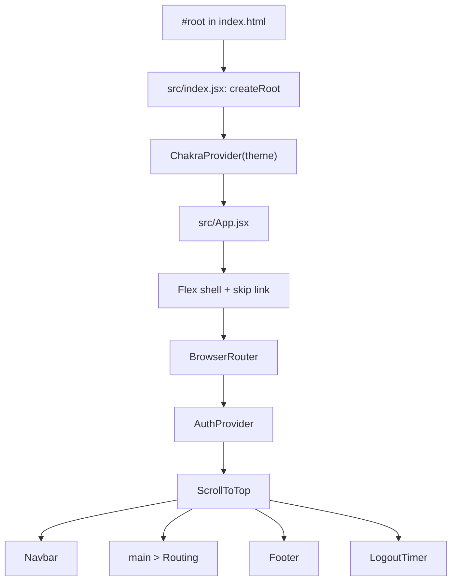
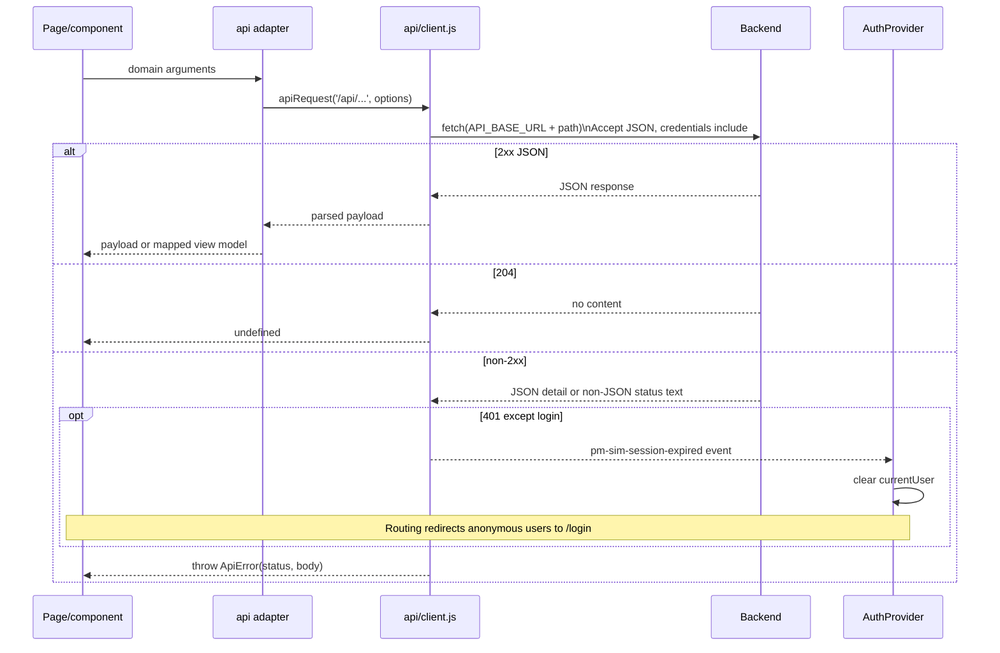
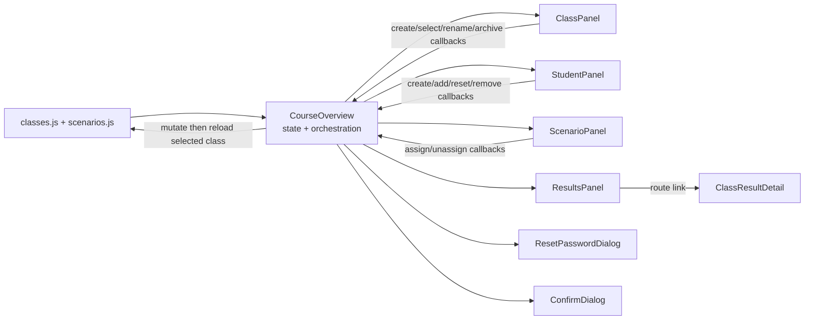
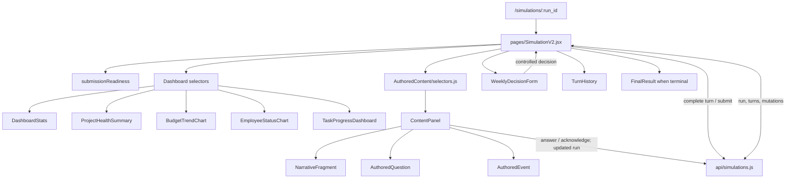

# Frontend architecture

This document is the maintainer's map of the PM-Sim frontend. It describes the
current React application, the boundary with the backend, and the conventions to
preserve when adding a route or workflow. Paths in this document are relative to
`frontend/`.

## Directory map

```text
src/
├── pages/                 Route-level orchestration and page state
│   ├── Landing.jsx        Public landing page
│   ├── Login.jsx          Session creation
│   ├── ScenarioOverview.jsx
│   │                      Professor scenario library and student assignments
│   ├── SimulationV2.jsx   Student run workspace
│   ├── CourseOverview.jsx Professor class workspace
│   ├── ClassResultDetail.jsx
│   │                      One student's run and authored-content audit
│   ├── AuditOverview.jsx  Administrative activity log
│   └── …                  Help and password pages
├── components/            Reusable presentation and feature components
│   ├── ClassManagement/   Class, roster, assignment, and result panels/dialogs
│   ├── SimulationV2/      Decision, authored-content, dashboard, and result UI
│   ├── FeedbackStates.jsx Shared loading, empty, and request-error states
│   └── …                  Application shell and shared dialogs/content
├── api/                   Backend boundary: transport plus endpoint adapters
│   ├── client.js          Fetch configuration and normalized errors
│   ├── auth.js            Session and password endpoints
│   ├── audit.js           Audit endpoints and audit view-model mapping
│   ├── classes.js         Classes, students, assignments, and results
│   ├── scenarios.js       Scenario lifecycle and availability
│   └── simulations.js     Runs, turns, authored content, and submission
├── context/
│   └── AuthProvider.jsx   Restored session and authentication actions
├── utils/
│   └── resultPresentation.js
│                          Shared human-readable labels and value formatting
└── images/                Imported static image assets (not component logic)

tests/
└── visual/
    └── pages.spec.js      Playwright page-level visual regression coverage
```

Keep route orchestration in `pages`, feature rendering in `components`, HTTP
knowledge in `api`, cross-tree application state in `context`, and pure reusable
transformations in `utils`. Unit tests live beside the source they exercise;
browser visual tests live in `tests/visual`.

## Bootstrap, providers, and routing

### Bootstrap flow



1. `src/index.jsx` imports global CSS, creates the React root, and wraps `App` in
   Chakra's `ChakraProvider` using the theme from `src/theme.js`. It invokes
   `reportWebVitals()` after rendering, without a reporter by default.
2. `src/App.jsx` establishes the persistent page shell and accessibility skip
   link. `BrowserRouter` owns URL history; `AuthProvider` is inside it and makes
   session state available to the navigation and routed pages. `ScrollToTop`
   wraps the navbar, route outlet, footer, and inactivity logout timer.
3. `src/theme.js` extends Chakra with the `brand` and `chart` palettes, semantic
   page/surface/text/border/focus tokens, system fonts, card radius/shadows,
   global minimum-height and focus-visible rules, and default Button styling.
   Prefer these tokens over feature-local colors when a semantic token exists.
4. `AuthProvider` initially exposes `isAuthenticating: true` and calls
   `GET /api/auth/me`. A successful response becomes `currentUser`; a 401 is the
   expected anonymous state, while other restoration failures are logged. Login
   and logout update the same state. The provider also listens for
   `pm-sim-session-expired`, emitted by the HTTP client after authenticated 401s,
   and clears the user.
5. `src/Routing.jsx` holds route policy. It shows one full-page loading state
   while session restoration is unresolved, then builds the public, anonymous,
   authenticated, and professor-only routes described below.

### Route matrix

“Professor/student” describes frontend availability, not backend authorization;
the backend must enforce every permission independently.

| Route | Authentication | Professor | Student | Page/component | Key API dependencies | Fallback or redirect |
|---|---|---:|---:|---|---|---|
| `/` | Anonymous or authenticated | Yes | Yes | `Landing` when anonymous | None | Any authenticated user is replaced to `/scenarios`. |
| `/login` | Anonymous only | No | No | `Login` | `auth.login` | An authenticated user is replaced to `/`, which then resolves to `/scenarios`. |
| `/scenarios` | Required | Yes | Yes | `ScenarioOverview` | Professor: scenario list/validate/create/publish/archive. Student: available scenarios plus simulation list/start. | A guest's wildcard route replaces the URL with `/login`. |
| `/simulations/:run_id` | Required | Yes | Yes | `SimulationV2` | simulation get/turn list/complete turn; content answer/acknowledge; submit | Load failure is rendered in-page. Guests go to `/login`. Backend ownership remains authoritative. |
| `/help` | Required | Yes | Yes | `Help` | None | Guests go to `/login`. |
| `/change-password` | Required | Yes | Yes | `ChangePassword` | `auth.changePassword` | Guests go to `/login`. |
| `/classes` | Required, professor role | Yes | No | `CourseOverview` | all class/student/assignment/result adapters; owned scenarios and revisions | An authenticated student reaches authenticated `*` and sees `NotFoundPage`; a guest goes to `/login`. |
| `/classes/:class_id/results/:run_id` | Required, professor role | Yes | No | `ClassResultDetail` | `classes.getClassResult` (including mapped run audit) | Request errors render in-page. Students see `NotFoundPage`; guests go to `/login`. |
| `/audit` | Required, professor role | Yes | No | `AuditOverview` | `audit.listAuditEntries` | Students see `NotFoundPage`; guests go to `/login`. |
| Any other path (`*`) | Depends on session | Yes | Yes | `NotFoundPage` for an authenticated user | None | Anonymous users are replaced to `/login`. |

Route parameters use backend identifiers only to address resources. Do not turn
them into user-facing labels. Adding a route requires updating this table and
checking anonymous, student, and professor behavior.

## HTTP and API boundary

### Request flow



`src/api/client.js` is the only generic transport:

- `VITE_API_BASE_URL` is read at build time. A single trailing slash is removed;
  when unset it is the empty string, so `/api/...` requests are relative to the
  frontend origin (normally handled by a development proxy or same-origin
  deployment). Adapter paths must begin with `/`.
- Every request advertises `Accept: application/json`. A request with a body gets
  `Content-Type: application/json` unless its caller supplied another type.
- `credentials: 'include'` sends and accepts the session cookie for both
  same-origin and allowed cross-origin requests. CORS and cookie attributes are
  therefore deployment requirements when the base URL is cross-origin.
- Successful `204` responses become `undefined`; other successful responses are
  parsed as JSON.
- Failed responses are parsed as JSON when possible and otherwise use
  `response.statusText`. `ApiError.message` prefers a string `detail`, then the
  first FastAPI-style `detail[].msg`, then “Request failed”. `getFieldErrors()`
  converts validation entries such as `loc: ['body', 'field']` into a field/message
  object; `status` and the original `body` remain available for conflict handling.
- A 401 from any endpoint except `/api/auth/login` emits the session-expired
  event. The client does not directly manipulate history: `AuthProvider` clears
  authentication and `Routing` performs the declarative redirect to `/login`.
  Logout calls the backend, but clears local state in `finally`, even if the
  request fails.

Do not call `fetch` directly from feature code. Add a narrowly named adapter and
pass domain arguments rather than making pages know URL or cookie details.

### API adapter catalogue

Unless mapping is explicitly noted, adapters return backend JSON unchanged.
Snake_case wire fields consequently remain in the route-level data model; local
selectors may derive presentation models without mutating the response.

#### `src/api/auth.js`

| Adapter | Request | Purpose / mapping |
|---|---|---|
| `getCurrentUser()` | `GET /api/auth/me` | Restore the cookie-backed user; returned unchanged. |
| `login(username, password)` | `POST /api/auth/login` | Sends `{ username, password }`; returns the user unchanged. |
| `logout()` | `POST /api/auth/logout` | Ends the server session; normally a 204/`undefined`. |
| `changePassword(currentPassword, newPassword)` | `PUT /api/auth/password` | Maps camelCase arguments to `current_password` and `new_password`. |

#### `src/api/audit.js`

| Adapter | Request | Purpose / mapping |
|---|---|---|
| `listAuditEntries(limit = 50, offset = 0)` | `GET /api/audit?limit=…&offset=…` | Paginated professor activity; raw entries are formatted by `AuditOverview`. |
| `mapProfessorContentAudit(audit)` | Pure mapping | Converts delivery, response, and effect wire fields to camelCase view models; associates responses/effects with deliveries by `sequence_entry_id`, sorts deliveries by `sequenceOrdinal`, defaults digest status, and maps divergences. |
| `mapRunAudit(result)` | Pure mapping | Preserves the class-result payload and exposes mapped `content_audit` as `contentAudit`. |

This file is the principal backend-payload-to-view-model boundary. In particular,
`ProfessorAuthoredTimeline` consumes `contentAudit` rather than wire-level audit
field names.

#### `src/api/classes.js`

| Adapter | Request | Body / result |
|---|---|---|
| `listClasses()` / `createClass(name)` | `GET/POST /api/classes` | Create sends `{ name }`; results are raw. |
| `renameClass(classId, name)` | `PATCH /api/classes/:classId` | Sends `{ name }`. |
| `archiveClass(classId)` | `POST /api/classes/:classId/archive` | Archives an active class. |
| `listStudents(classId)` | `GET /api/classes/:classId/students` | Raw roster. |
| `importStudents(classId, students)` | `POST …/students/import` | Sends `{ students }`; used for creating/importing accounts. |
| `addStudent(classId, username)` | `POST …/students` | Sends `{ username }` to add an existing account. |
| `removeStudent(classId, studentId)` | `DELETE …/students/:studentId` | Removes membership. |
| `resetStudentPassword(classId, studentId, newPassword)` | `PUT …/students/:studentId/password` | Maps to `{ new_password }`. |
| `listAssignedScenarios(classId)` / `assignScenario(classId, scenarioRevisionId)` | `GET/POST …/scenarios` | Assignment sends `{ scenario_revision_id }`. |
| `unassignScenario(classId, revisionId)` | `DELETE …/scenarios/:revisionId` | Removes an assignment (the caller supplies the assignment/revision identifier returned by the backend). |
| `listClassResults(classId)` | `GET …/results` | Raw result summaries. |
| `getClassResult(classId, runId)` | `GET …/results/:runId` | The only mapped class call: chains `mapRunAudit`. |

#### `src/api/scenarios.js`

| Adapter | Request | Body / result |
|---|---|---|
| `listAvailableScenarios()` | `GET /api/classes/available-scenarios` | Student assignments, raw. |
| `listOwnedScenarios()` | `GET /api/scenarios` | Professor-owned scenarios, raw. |
| `listScenarioRevisions(scenarioId)` | `GET /api/scenarios/:scenarioId` | Raw revision list. |
| `validateScenario(definition)` | `POST /api/scenarios/validate` | Sends the definition itself and returns the backend-normalized definition. |
| `createScenario(definition)` | `POST /api/scenarios` | Sends the validated/normalized definition itself. |
| `publishScenarioRevision(scenarioId, revisionNumber)` | `POST …/revisions/:revisionNumber/publish` | Publishes a draft. |
| `archiveScenario(scenarioId)` | `POST /api/scenarios/:scenarioId/archive` | Archives the scenario. |

#### `src/api/simulations.js`

| Adapter | Request | Body / result |
|---|---|---|
| `listSimulationRuns()` | `GET /api/simulations` | Current student's raw run summaries. |
| `getSimulationRun(runId)` | `GET /api/simulations/:runId` | Raw run, state, deliveries, and employee types. |
| `startSimulationRun(scenarioRevisionId, seed, classId)` | `POST /api/simulations` | Maps to `{ scenario_revision_id, seed, class_id }`. |
| `listSimulationTurns(runId)` | `GET …/:runId/turns` | Raw decision/outcome history. |
| `completeSimulationTurn(runId, decision, idempotencyKey)` | `POST …/:runId/turns` | Sends decision (including caller-added `expected_version`) and an `Idempotency-Key` header. |
| `answerContentEntry(runId, entryId, answer, expectedVersion, idempotencyKey)` | `POST …/content/:entryId/answer` | Sends `{ expected_version, answer }` with idempotency key. |
| `acknowledgeContentEntry(runId, entryId, expectedVersion, idempotencyKey)` | `POST …/content/:entryId/acknowledge` | Sends `{ expected_version }` with idempotency key. |
| `submitSimulationRun(runId, expectedVersion)` | `POST …/:runId/submit` | Optimistic-concurrency body `{ expected_version }`. |

## Professor workflows

### Scenario lifecycle

`ScenarioOverview` switches on `currentUser.role`. Professors load owned
scenarios, import backend-v2 JSON through `ScenarioImportDialog`, validate it,
create the normalized result, and refresh the list. Draft latest revisions can be
published; scenarios can be archived after confirmation. The visual scenario
editor is intentionally outside this version.

### Class, student, assignment, and result management

`CourseOverview` first loads active classes and, independently, all owned scenario
revision groups, retaining only published revisions for assignment. Selecting a
class loads its roster, assignments, and results in parallel.

- **Classes:** `ClassPanel` selects, creates, renames, and requests confirmation
  before archival. Creating selects the returned class; archiving clears the
  selection and refreshes active classes.
- **Students:** `StudentPanel` can create a student through the one-row import
  endpoint, add an existing username, open `ResetPasswordDialog`, or confirm
  removal. Details refresh after each successful mutation.
- **Assignments:** `ScenarioPanel` receives published revisions and current
  assignments, assigning by revision and confirming unassignment.
- **Results:** `ResultsPanel` links a run to
  `/classes/:class_id/results/:run_id`. `ClassResultDetail` loads the run, displays
  outcome scores, the same public project-health dashboards students saw, weekly
  decisions/events, and the mapped professor authored-content timeline. Raw IDs
  and payloads are confined to its explicitly disclosed “Technical details” area
  for support/audit use, never primary teaching copy.

All mutations funnel through `runAction`: clear prior feedback, lock the workspace
with `isBusy`, execute, show success/error feedback, and normally reload the
selected class details. Destructive operations use `ConfirmDialog`.

### Administrative audit

`AuditOverview` requests 50 audit entries at a time. It presents human-readable
timestamps/actions/targets, with raw details behind a technical disclosure, and
uses offset-based Previous/Next navigation. This administrative activity log is
separate from the per-run authored-content integrity audit shown in result detail.

### CourseOverview component/data flow



The panels are controlled presentation components. `CourseOverview` owns selected
class identity, loaded collections, request status, confirmation targets, and the
mutation/refetch policy; panels own only ephemeral form inputs or disclosure UI.

## Student workflow

1. **Discover assignments.** `ScenarioOverview` loads available class scenarios
   and the student's run summaries concurrently. `scenarioAssignmentKey` joins a
   run to an assignment using class ID plus scenario revision ID, while cards show
   names and statuses rather than those IDs. Empty assignments get an actionable
   explanation.
2. **Create or resume a run.** A new assignment starts with a random seed, revision
   ID, and class ID. A ref-backed set prevents duplicate starts. The returned run
   navigates to `/simulations/:run_id`; existing active or completed runs open the
   same route.
3. **Load the workspace.** `SimulationV2` requests the run and turn history in
   parallel, opens the scenario briefing, initializes a weekly decision, and
   derives dashboard and authored-content presentation from the responses.
4. **Review health and plan a week.** The student sees schedule progress,
   headline stats, project-health guidance, budget/team/task dashboards, authored
   content, submission readiness, and `WeeklyDecisionForm`. The form covers work
   allocation, hires/dismissals, overtime, meetings, and training, and validates
   that activity percentages and numeric inputs are valid.
5. **Complete authored content.** `selectContentState` orders deliveries and finds
   the earliest actionable required entry. Required incomplete content blocks the
   weekly decision and receives focus. `ContentPanel` renders narrative,
   question, and event variants and uses answer/acknowledge adapters with version
   and idempotency controls. A 409 triggers a canonical reload before retry.
6. **Complete the week.** The page sends the run's `expected_version`, decision,
   and a generated idempotency key. On non-conflict failure it retains the exact
   pending request so “Retry week” reuses the key and decision. Success replaces
   the run, resets the form, and refreshes turns; a 409 discards the stale request,
   reloads, and asks the student to review concurrent changes.
7. **Inspect history and completion.** Turn outcomes appear in `TurnHistory`; the
   dashboards recompute from resulting-state snapshots. A backend-completed run
   replaces the decision area with `FinalResult`.
8. **Submit early or at readiness.** Submission readiness is integration-tested
   tasks divided by total project tasks. Eighty percent is guidance, not a gate.
   `ConfirmDialog` explains that only integration-tested tasks are accepted; an
   optimistic version is sent and the returned terminal run renders its result.

### SimulationV2 component/data flow



`SimulationV2` is the orchestration boundary: it owns canonical server snapshots,
request lifecycle, retry identity, modals/drawers, and the controlled decision.
Children render props and emit intent; adapters own wire operations; pure
selectors own derivation.

## Presentation models and selectors

### Shared result presentation

`src/utils/resultPresentation.js` centralizes teaching-facing formatting:

- `plainLanguageLabel` applies explicit vocabulary overrides and otherwise turns
  snake_case into title case; `readableStatus` adds status-specific copy.
- `statusColor` maps completed/submitted/deadline states to consistent Chakra
  schemes with a gray default.
- `formatDateTime`, `formatMoney`, and `formatPercent` use locale-aware `Intl`
  formatting and safe empty text.
- `formatTeachingValue` recursively formats arrays and objects, recognizes
  monetary/percentage keys, translates booleans, and avoids dumping opaque JSON
  into ordinary teaching fields.

Add generally reusable result vocabulary here rather than duplicating formatters
in pages. Feature-specific chart labels can remain next to their selector.

### Authored-content selectors

`components/SimulationV2/AuthoredContent/selectors.js` is the public derivation
surface for content delivery:

- `orderedContentEntries` removes entries explicitly marked `visible: false` and
  sorts a copy by `sequence_ordinal`.
- `selectEarliestActionableRequiredEntry` selects the first required entry whose
  backend status is `actionable`.
- `selectRequiredContentBlocking` reports whether that entry exists.
- `selectContentFeedback` safely extracts optional feedback.
- `selectContentState` returns `{ entries, earliestActionableRequiredEntry,
  isBlocking }` so the page and panel share one interpretation.
- The final three aliases preserve older import names; new code should prefer the
  `select…` names.

### Dashboard selectors

Dashboard components keep pure backend-to-chart derivation near the chart:

- `BudgetTrendChart.selectBudgetTrend` constructs ordered cost/schedule snapshots,
  including planned spend and the current point.
- `EmployeeStatusChart.selectEmployeeStatusTrend` averages stress, motivation,
  and familiarity per weekly team snapshot; `toPercentage` normalizes display.
- `TaskProgressDashboard.orderedSnapshots` orders historical/current state and
  `selectTaskProgress` calculates current/previous pool totals. `taskPoolTotal`
  is the shared easy/medium/hard pool reducer.
- `ProjectHealthSummary.selectProjectHealthSummary` translates current-versus-
  previous budget, team, and task signals into concise navigation guidance.
- `submissionReadiness` in the page derives accepted-work readiness, and
  `WeeklyDecisionForm.deriveEmployeeDisplayModels` joins employee records to type
  metadata for labels without changing the wire model.

Selectors must be deterministic and side-effect free. They should accept raw
snapshots and return the smallest view model needed by a component, making
missing/empty arrays safe and retaining no stale copy of server state.

### Identifier boundary

API identifiers remain internal implementation data. They may be used as React
keys, route parameters, adapter arguments, relationship joins, optimistic-version
tokens, focus anchors, or explicit professor-only technical/audit evidence. They
must not appear in normal headings, labels, alerts, chart legends, success copy,
or student instructions. Resolve an ID to a scenario, class, employee type, or
student display name before presentation. Never treat display text as an ID when
making a request.

## State and feedback conventions

Use **local component state** for UI state that has one clear owner and does not
need to survive navigation: form drafts, selected tabs/classes, dialog targets,
drawers, a pending idempotent submission, and a page's loading/error/success
status. Lift state to the nearest page when sibling feature panels coordinate
through it. Use context only for genuinely application-wide state such as the
authenticated user; do not mirror API collections in context. Server responses
remain canonical and should be refreshed after mutations or conflicts.

Represent request states deliberately:

| State | Representation |
|---|---|
| Loading | `PageLoadingState` with a specific, present-progress label. Preserve the page shell when possible and expose status through its live region. Buttons use `isLoading` for local mutations. |
| Error | `RequestError` with a plain-language title and actionable message. Keep successful content visible for recoverable mutation errors; use a page-level error only when no canonical data can render. |
| Empty | `EmptyState` with a factual title, explanation of why it may be empty, and an action when the user can resolve it. Empty is not an error. |
| Conflict | Detect `ApiError.status === 409`, discard stale optimistic input/idempotency state when unsafe, reload canonical data, and explain that another tab/request changed it. Do not silently overwrite. |
| Retry | Keep or reconstruct the exact safe request and offer an explicit retry action. Idempotent simulation writes must reuse their `Idempotency-Key`; show that retry is available. For read failures, connect the `EmptyState` action or nearby button to the load function. |
| Success | Use a concise success alert and refresh affected canonical collections. Clear stale error/success messages at the next action's start. |

`FeedbackStates.jsx` currently exports `PageLoadingState`, `EmptyState`, and
`RequestError`; compose conflict, retry, and success behavior around these shared
primitives rather than inventing inconsistent page-specific spinners or error
cards. Feedback must not expose raw IDs, stack traces, or backend payloads.

## Change checklist

When extending the frontend:

1. Put URL/cookie/wire behavior in an API adapter and document any new payload
   mapping.
2. Keep route access explicit and update the route matrix.
3. Derive view models with pure selectors; keep API IDs behind the presentation
   boundary.
4. Use controlled components and page-owned orchestration for coordinated flows.
5. Provide loading, error, empty, conflict, retry, and success behavior as
   applicable using the shared feedback vocabulary.
6. Add colocated unit tests for transformations/interactions and update
   `tests/visual/pages.spec.js` when a route's visible contract changes.
